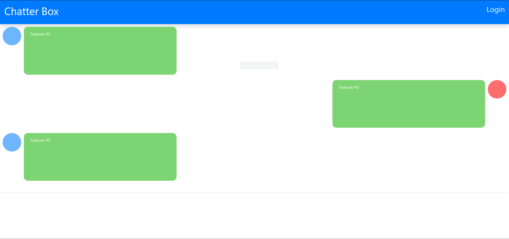
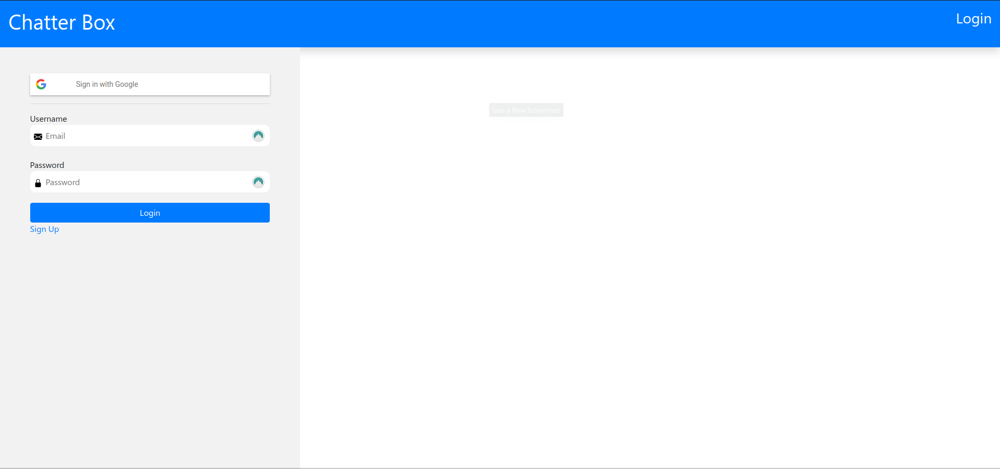
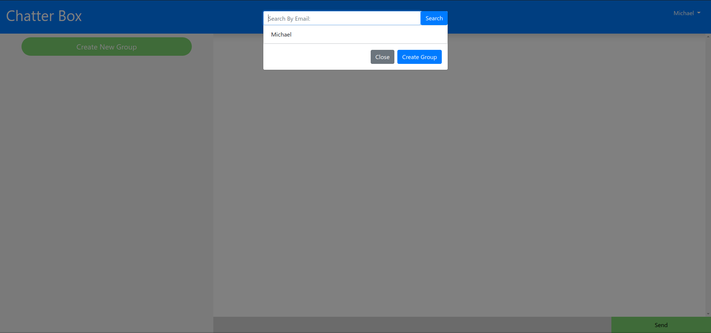
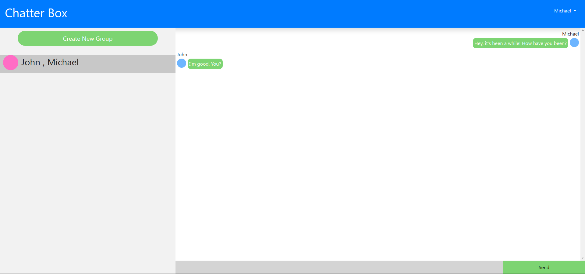

# Chatter Box

ChatterBox is a platform where users can message and communicate with their friends online! You can communicate with 1 friend or 10 friends. The group size doesn't matter.

1. First, go to the Chatter Box website. The homepage should look like this image: 

2. Click login on the top-right corner of the homepage. It should bring you to the login page where you can register/login with an email and password. You can also sign in with Google.

3. After logging in, you can create a group by clicking the green "Create New Group" button. After that, you can add members to a group by searching with their email.

4. After creating a group, you can click on the group to start messaging in it. Messaging in a group should look like the following image: 
